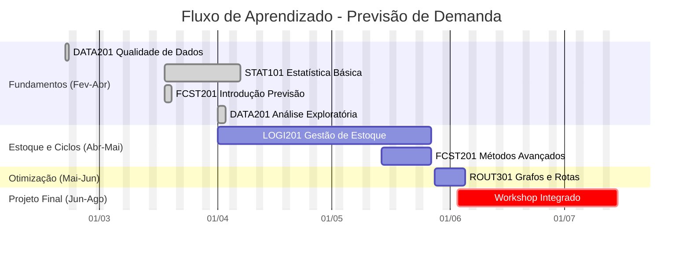

Este cronograma utiliza uma abordagem de **aprendizado entrelaçado**, onde conceitos fundamentais (Estatística) são imediatamente aplicados em métodos de previsão e gestão de estoque na mesma diária, reforçando a retenção do conhecimento.

## Visualização da Trilha

## Calendário Detalhado

### Módulo 1: Qualidade de Dados e Banco de Dados — 20/02 (Sex)

<Callout type="info" title="Material da Aula">
[Ver Apresentação no Figma](https://www.figma.com/deck/9mIUKmeNBUUnt8li7uDfx6)
</Callout>

| Matéria | Tópico | Tipo |
| :------ | :---------------------------------------- | :--- |
| [DATA201](./data201) | **Conceito**: Qualidade de Dados | <Badge variant="note">Teoria</Badge> |
| [DATA201](./data201) | **Conceito**: Estruturação de Banco de Dados | <Badge variant="note">Teoria</Badge> |
| [DATA201](./data201) | **Conceito**: Normalização 1NF e 2NF | <Badge variant="tip">Teoria+Prática</Badge> |

---

### Módulo 2: Fundamentos e Primeiros Modelos — 18/03 (Qua)

<Callout type="info" title="Material da Aula">
[Ver Apresentação no Figma](https://www.figma.com/deck/HFU48kIGrwKCIG63JyhHij)
</Callout>

| Matéria | Tópico | Tipo |
| :------ | :---------------------------------------- | :--- |
| [STAT101](./stat101) | **Conceito**: Medidas de Tendência Central (Média, Mediana) | <Badge variant="note">Teoria+Prática</Badge> |
| [FCST201](./fcst201) | **Aplicação**: O método de Médias Móveis Simples | <Badge variant="tip">Teoria+Prática</Badge> |
| [EXCL101](./excl101) | **Ferramenta**: Construindo previsão por média no Excel | <Badge variant="success">Lab</Badge> |

---

### Módulo 3: Dispersão e Estoque de Segurança — 26/03 (Qui)

<Callout type="info" title="Material da Aula">
[Ver Apresentação no Figma](https://www.figma.com/deck/zGeW89bjz9ML1SleDWXLI9)
</Callout>

| Matéria | Tópico | Tipo |
| :------ | :---------------------------------------- | :--- |
| [STAT101](./stat101) | **Conceito**: Dispersão (Desvio Padrão) e Normal | <Badge variant="note">Teoria</Badge> |
| [LOGI201](./logi201) | **Aplicação**: Estoque de Segurança (protegendo da variação) | <Badge variant="tip">Teoria+Prática</Badge> |
| [EXCL101](./excl101) | **Ferramenta**: Calculadora de Estoque de Segurança | <Badge variant="success">Lab</Badge> |

---

### Módulo 4: Análise de Dados e Ciclos — 01/04 (Qua)

<Callout type="info" title="Material da Aula">
[Ver Apresentação no Figma](https://www.figma.com/deck/OcMDlkqgmlvAL8bagbmJDH)
</Callout>

| Matéria | Tópico | Tipo |
| :------ | :---------------------------------------- | :--- |
| [STAT101](./stat101) | **Conceito**: Outliers e Hipótese Nula (Intuição) | <Badge variant="note">Teoria</Badge> |
| [DATA201](./data201) | **Aplicação**: EDA - Identificando anomalias na demanda | <Badge variant="tip">Prática</Badge> |
| [LOGI201](./logi201) | **Visualização**: Padrão Dente de Serra (Ciclos de estoque) | <Badge variant="note">Teoria</Badge> |
| Workshop | Discussão de Caso Real | <Badge variant="success">Dinâmica</Badge> |
| [LOGI201](./logi201) | **Conceito**: Ponto de Reposição (Quando pedir?) | <Badge variant="note">Teoria</Badge> |

---

### Módulo 5: Sazonalidade e Segmentação — 09/04 (Qui)

<Callout type="info" title="Material da Aula">
[Ver Apresentação no Figma](https://www.figma.com/deck/6xGaKDPl2AKIYtwsd5plMR)
</Callout>

| Matéria | Tópico | Tipo |
| :------ | :---------------------------------------- | :--- |
| [FCST201](./fcst201) | **Impacto**: Erro de Previsão vs. Ruptura de Estoque | <Badge variant="tip">Teoria+Prática</Badge> |
| Workshop | **Simulação**: O custo da falta (Stockout game) | <Badge variant="success">Dinâmica</Badge> |
| [LOGI201](./logi201) | **Emergência**: Custo de Falta vs. Custo de Sobra — trade-off explorado via Beer Game | <Badge variant="note">Teoria</Badge> |
| [LOGI201](./logi201) | **Emergência**: Nível de Serviço — intuição construída pelos resultados do jogo | <Badge variant="note">Teoria</Badge> |
| [STAT101](./stat101) | **Conceito**: Correlação e Causalidade | <Badge variant="note">Teoria</Badge> |
| [DATA201](./data201) | **Conceito**: Decomposição de Séries (Tendência/Sazonalidade) | <Badge variant="note">Teoria</Badge> |
| [FCST201](./fcst201) | **Aplicação**: Ajustando previsões para Sazonalidade | <Badge variant="tip">Prática</Badge> |
| [DATA201](./data201) | **Conceito**: Princípio de Pareto (80/20) | <Badge variant="note">Teoria</Badge> |
| [LOGI201](./logi201) | **Aplicação**: Curva ABC para Gestão de Estoque | <Badge variant="tip">Prática</Badge> |
| [EXCL101](./excl101) | **Ferramenta**: Construindo a Curva ABC no Excel | <Badge variant="success">Lab</Badge> |

---

### Módulo 6: Comunicação e Consolidação I

<Callout type="info" title="Material da Aula">
[Ver Apresentação no Figma](https://www.figma.com/deck/t9czIV0eyIEVlIYm2rhSmU)
</Callout>

| Matéria | Tópico | Tipo |
| :------ | :---------------------------------------- | :--- |
| [DATA201](./data201) | **Conceito**: Visualização de Dados Eficiente | <Badge variant="note">Teoria</Badge> |
| [DATA201](./data201) | **Técnica**: Data Storytelling para Gestores | <Badge variant="tip">Prática</Badge> |
| Workshop | **Atividade**: Apresentação de Resultados (Mock) | <Badge variant="success">Dinâmica</Badge> |

---

### Módulo 7: Gestão de Suprimentos Avançada

<Callout type="info" title="Material da Aula">
[Ver Apresentação no Figma](https://www.figma.com/deck/NgxsJBoZBDQbhMrKiuJ85r)
</Callout>

| Matéria | Tópico | Tipo |
| :------ | :---------------------------------------- | :--- |
| [LOGI201](./logi201) | **Revisão**: Parâmetros de Estoque (ROP, ES) | <Badge variant="caution">Revisão</Badge> |
| [LOGI201](./logi201) | **Conceito**: Lead Time e Variabilidade de Fornecimento | <Badge variant="note">Teoria</Badge> |
| [LOGI201](./logi201) | **Aplicação**: Impacto do Lead Time no ROP | <Badge variant="tip">Prática</Badge> |
| Workshop | Estudo de Caso: Ruptura na Base Aérea | <Badge variant="success">Caso</Badge> |
| Workshop | Análise de Causa Raiz | <Badge variant="tip">Prática</Badge> |
| [LOGI201](./logi201) | **Conceito**: Nível de Serviço — significado estatístico e operacional | <Badge variant="note">Teoria</Badge> |
| [LOGI201](./logi201) | **Aplicação**: Custo de Falta vs. Custo de Sobra — quantificação dentro do estudo de caso | <Badge variant="tip">Prática</Badge> |
| [LOGI201](./logi201) | **Debate**: Risco vs. Custo — trade-offs gerenciais na Força Aérea | <Badge variant="success">Dinâmica</Badge> |
| Workshop | Apresentação de Soluções do Caso | <Badge variant="success">Dinâmica</Badge> |

---

### Módulo 8: Economia e Suprimento

<Callout type="info" title="Material da Aula">
[Ver Apresentação no Figma](https://www.figma.com/deck/Dg1Vv39StP0KjeugTixXiB)
</Callout>

| Matéria | Tópico | Tipo |
| :------ | :---------------------------------------- | :--- |
| [LOGI201](./logi201) | **Abertura**: Feedback da Prática do Módulo 7 — pontos de atenção e acertos por cenário | <Badge variant="caution">Revisão</Badge> |
| [LOGI201](./logi201) | **Conceito**: Curva de Suprimento | <Badge variant="note">Teoria</Badge> |
| [LOGI201](./logi201) | **Aplicação**: Análise de propostas de fornecedores com base nos parâmetros calculados | <Badge variant="tip">Prática</Badge> |

---

### Módulo 9: Lote Econômico e KPIs

| Matéria | Tópico | Tipo |
| :------ | :---------------------------------------- | :--- |
| [LOGI201](./logi201) | **Conceito**: Custos de Pedido vs. Custos de Posse | <Badge variant="note">Teoria</Badge> |
| [LOGI201](./logi201) | **Modelo**: EOQ (Lote Econômico de Compra) | <Badge variant="note">Teoria</Badge> |
| [EXCL101](./excl101) | **Ferramenta**: Calculadora EOQ e Sensibilidade | <Badge variant="success">Lab</Badge> |
| [LOGI201](./logi201) | **Conceito**: KPIs Logísticos (Giro, Cobertura) | <Badge variant="note">Teoria</Badge> |
| [DATA201](./data201) | **Aplicação**: Dashboard de KPIs de Estoque | <Badge variant="tip">Prática</Badge> |
| Workshop | Análise de Saúde do Estoque (Dataset Real) | <Badge variant="success">Dinâmica</Badge> |

---

### Módulo 10: Previsão Avançada

| Matéria | Tópico | Tipo |
| :------ | :---------------------------------------- | :--- |
| [FCST201](./fcst201) | **Conceito**: Limitações da Média Móvel | <Badge variant="note">Teoria</Badge> |
| [FCST201](./fcst201) | **Intro**: Média Móvel Ponderada | <Badge variant="note">Teoria</Badge> |
| [FCST201](./fcst201) | **Aplicação**: Definindo pesos para dados recentes | <Badge variant="tip">Prática</Badge> |
| Workshop | Competição de Previsão (Ponderada vs Simples) | <Badge variant="success">Dinâmica</Badge> |
| [FCST201](./fcst201) | **Conceito**: Suavização Exponencial Simples (SES) | <Badge variant="note">Teoria</Badge> |
| [FCST201](./fcst201) | **Aplicação**: O parâmetro Alpha | <Badge variant="tip">Prática</Badge> |
| [EXCL101](./excl101) | **Ferramenta**: Implementando SES no Excel | <Badge variant="success">Lab</Badge> |

---

### Módulo 11: Regressão Linear e Decomposição

| Matéria | Tópico | Tipo |
| :------ | :---------------------------------------- | :--- |
| [STAT101](./stat101) | **Conceito**: Regressão Linear Simples — Intuição e Equação | <Badge variant="note">Teoria</Badge> |
| [FCST201](./fcst201) | **Aplicação**: Previsão por Tendência com Regressão | <Badge variant="tip">Prática</Badge> |
| [EXCL101](./excl101) | **Ferramenta**: Linha de Tendência e PROJ.LIN no Excel | <Badge variant="success">Lab</Badge> |
| [DATA201](./data201) | **Conceito**: Decomposição de Séries Temporais (Tendência + Sazonalidade + Resíduo) | <Badge variant="note">Teoria</Badge> |
| [EXCL101](./excl101) | **Ferramenta**: Decomposição passo-a-passo no Excel | <Badge variant="success">Lab</Badge> |

---

### Módulo 12: Qualidade da Previsão

| Matéria | Tópico | Tipo |
| :------ | :---------------------------------------- | :--- |
| [FCST201](./fcst201) | **Conceito**: Métricas de Erro (MAD, MSE, MAPE) | <Badge variant="note">Teoria</Badge> |
| [FCST201](./fcst201) | **Conceito**: Viés (Bias) de Previsão | <Badge variant="note">Teoria</Badge> |
| Workshop | **Aplicação**: Diagnosticando modelos ruins | <Badge variant="tip">Prática</Badge> |

---

### Módulo 13: Workshop de Negociação com Fornecedores

| Matéria | Tópico | Tipo |
| :------ | :---------------------------------------- | :--- |
| [LOGI201](./logi201) | **Preparação**: Cada grupo consolida seus parâmetros (ROP, ES, lote) como argumento de contrato | <Badge variant="caution">Revisão</Badge> |
| Workshop | **Rodada 1 — Comprador**: Grupo apresenta exigências contratuais (prazo de entrega, lote mínimo, SLA de atendimento) ao "comitê fornecedor" | <Badge variant="success">Dinâmica</Badge> |
| Workshop | **Defesa técnica**: Justificativa dos parâmetros estatísticos — por que o ROP e o ES calculados exigem esse nível de serviço do fornecedor | <Badge variant="tip">Prática</Badge> |
| Workshop | **Rodada 2 — Fornecedor**: Grupo adversário (ou professor) assume o papel de fornecedor e apresenta contra-proposta com restrições reais de mercado | <Badge variant="success">Dinâmica</Badge> |
| Workshop | **Debrief**: Negociação baseada em dados vs. negociação por pressão — lições, erros comuns e boas práticas | <Badge variant="note">Teoria+Prática</Badge> |

---

### Módulo 14: Introdução a Redes e Grafos

| Matéria | Tópico | Tipo |
| :------ | :---------------------------------------- | :--- |
| [ROUT301](./rout301) | **Conceito**: Teoria dos Grafos e Redes Logísticas | <Badge variant="note">Teoria</Badge> |
| [ROUT301](./rout301) | **Aplicação**: Modelando problemas reais como grafos | <Badge variant="tip">Prática</Badge> |
| [ROUT301](./rout301) | **Ferramenta**: Matrizes de Adjacência e Custos | <Badge variant="success">Lab</Badge> |
| Workshop | Desenhando a rede logística da Unidade | <Badge variant="success">Dinâmica</Badge> |

---

### Módulo 15: Algoritmos de Caminho Mínimo

| Matéria | Tópico | Tipo |
| :------ | :---------------------------------------- | :--- |
| [ROUT301](./rout301) | **Conceito**: Algoritmo de Dijkstra (Intuição) | <Badge variant="note">Teoria</Badge> |
| [ROUT301](./rout301) | **Aplicação**: Dijkstra passo-a-passo (Manual) | <Badge variant="tip">Prática</Badge> |
| Workshop | Desafio de Roteirização Manual | <Badge variant="success">Dinâmica</Badge> |

---

### Módulo 16: Roteirização Computacional

| Matéria | Tópico | Tipo |
| :------ | :---------------------------------------- | :--- |
| [ROUT301](./rout301) | **Conceito**: Vehicle Routing Problem (VRP) | <Badge variant="note">Teoria</Badge> |
| [ROUT301](./rout301) | **Aplicação**: Restrições de Capacidade e Tempo | <Badge variant="tip">Prática</Badge> |
| [EXCL101](./excl101) | **Ferramenta**: Solver para VRP Simples | <Badge variant="success">Lab</Badge> |
| [ROUT301](./rout301) | **Aplicação**: VRP com Múltiplos Veículos | <Badge variant="tip">Prática</Badge> |
| [EXCL101](./excl101) | **Ferramenta**: Otimização avançada no Excel | <Badge variant="success">Lab</Badge> |
| Workshop | Laboratório de Otimização de Rota | <Badge variant="success">Dinâmica</Badge> |

---

### Módulo 17: Consolidação e Aplicações Militares

| Matéria | Tópico | Tipo |
| :------ | :---------------------------------------- | :--- |
| [ROUT301](./rout301) | **Conceito**: Casos de Uso Militar (Vacinas, Emergência) | <Badge variant="note">Teoria</Badge> |
| Workshop | Briefing do Projeto Final Integrado | <Badge variant="danger">Projeto</Badge> |
| Workshop | Formação de Equipes e Definição de Escopo | <Badge variant="danger">Projeto</Badge> |
| Workshop | Coleta de Dados Inicial | <Badge variant="danger">Projeto</Badge> |

---

### Módulo 18: Projeto Integrado - Parte I

| Atividade | Foco |
| :-------- | :--- |
| Projeto Integrado | Dados e Previsão de Demanda |
| Projeto Integrado | Previsão e Planejamento de Estoque |

---

### Módulo 19: Projeto Integrado - Parte II

| Atividade | Foco |
| :-------- | :--- |
| Projeto Integrado | Estoque e Distribuição (Rotas) |
| Projeto Integrado | Consolidação em Dashboards e Relatório |

---

### Revisão e Exame

| Data | Atividade | Detalhe |
| :--- | :-------- | :------ |
| **14/07 (Ter)** | **Revisão Geral** | Conceitos Chave + Plantão de Dúvidas |
| **04/08 (Ter)** | **Reserva** | — |

